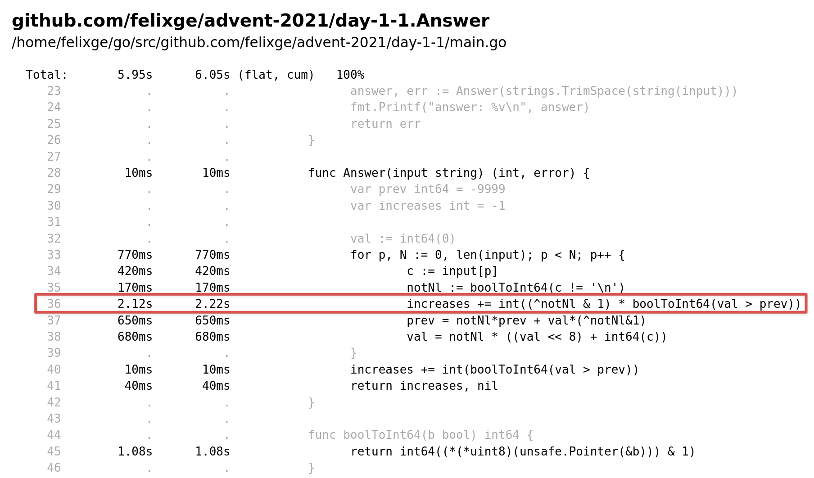

It seems like my [previous post](/2021/12/01/advent-of-go-profiling-2021-day-1-1/) has struck a chord and many of you have sent your own solutions [via twitter](https://twitter.com/felixge/status/1466128436355899395). Before I move on to pick another day as a challenge, I'd like to do a little follow up for day 1-1.

## Valentin Deleplace's Solution

Let's start with looking at the winning [solution](https://twitter.com/val_deleplace/status/1466442802330488838) from Valentin Deleplace which achieves a spectacular `13.8 ns/op` on my machine. This is `6.5x` faster than my `v3` solution and `23x` faster than my `v1` 🤯.

```go
func Answer(input string) (int, error) {
	var prev int64 = -9999
	var increases int = -1

	val := int64(0)
	for p, N := 0, len(input); p < N; p++ {
		c := input[p]
		if c != '\n' {
			val = (val << 8) + int64(c)
		} else {
			if val > prev {
				increases++
			}
			prev = val
			val = 0
		}
	}
	if val > prev {
		increases++
	}
	return increases, nil
}
```

I knew that my solution was not ideal, but the magnitude of the improvement still surprised me. So I decided to take a closer look to see how it was done:

- The call to `strings.IndexByte()` was retired in favor of directly looping over the individual characters of the input. This works well here because the average line length is very short (4 characters) and calling assembly functions from Go has a non-trivial overhead associated with it.
- Somewhat unexpectedly, the function body fits into Go's inlining budget. Build with `-gcflags='-m'` if you want to verify this yourself. This eliminates the overhead of calling the Answer function in the benchmark.
- Looping over the input is done without using `range` on the input string which avoids unicode overhead.
- Parsing of the input digits is directly integrated into the for loop and avoids iterating over those chars twice.
- `val << 8` is used instead of `val*10`. This changes `val`, but doesn't break the `val > prev` comparison.
- Instead of using a separate `bool` to indicate if a previous value has been seen, `prev` and `increases` are initialized to `-9999` and `-1` respectively which is fair game since we noticed the elves hesitance to throw negative numbers at us.
- Error handling such as checking for valid digits has been eliminated.

Most importantly Valentin's solution is far more compact than my `v3` and remains pretty readable given the circumstances 👏.

## Branchless Go

In my experience code optimization always involves a lot of trial and error. So I think it's important to acknowledge that optimization ideas often fail and to discuss what we can learn from these failures.

One such failure was my first attempt to further optimize Valentin's solution by eliminating branches. My inspiration for this came from Daniel Lemire's [Parsing JSON Really Quickly: Lessons Learned](https://www.infoq.com/presentations/simdjson-parser/) presentation as well as Matt Nakama's [Branchless Coding in Go](https://mattnakama.com/blog/go-branchless-coding/).

I've never done this before, so the code below can certainly be improved, but here is what I came up with:

```go
func Answer(input string) (int, error) {
	var prev int64 = -9999
	var increases int = -1

	val := int64(0)
	for p, N := 0, len(input); p < N; p++ {
		c := input[p]
		notNl := boolToInt64(c != '\n')
		increases += int((^notNl & 1) * boolToInt64(val > prev))
		prev = notNl*prev + val*(^notNl&1)
		val = notNl * ((val << 8) + int64(c))
	}
	increases += int(boolToInt64(val > prev))
	return increases, nil
}

func boolToInt64(b bool) int64 {
	return int64((*(*uint8)(unsafe.Pointer(&b))) & 1)
}
```

The core idea is to cast `bool` values into `0` or `1` which allows us to take a branch like this:

```go
if c != '\n' {
  val = (val << 8) + int64(c)
} else {
  val = 0
}
```

And turn it into the equivalent branch-free expression shown below:

```go
val = ((val << 8) + int64(c)) * boolToInt64(c != '\n')
```

This works because we always compute the expression from the first branch and then multiply it by `1` if the first branch should be taken, or `0` for the second branch which is the same as setting `val = 0` directly.

And while the `boolToInt64(c != '\n')` might look like a compilation nightmare, the Go compiler seems to emit something relatively reasonable (see https://godbolt.org/z/Tzr99vqr3):

```txt
CMPB    R8B, $10        ; compare c and '\n' (ASCII 10)
SETNE   "".b+5(SP)      ; store 1 on stack if c != '\n' otherwise 0
MOVBLZX "".b+5(SP), R9  ; move result from stack to register R9
ANDL    $1, R9          ; last part of int64((*(*uint8)(unsafe.Pointer(&b))) & 1
```

From my perspective, something like this would be even better:

```txt
CMPB    R8B, $10        ; compare c and '\n' (ASCII 10)
SETNE   R9              ; store 1 in R9 if c != '\n' otherwise 0
```

But alas — I wasn't able to get the compiler to generate this. Anyway, since we eliminated all branches, our solution should run very quickly now, right? Let's have a look:

```txt
$ benchstat v4-valentin.txt v5.txt 
name      old time/op  new time/op  delta
Answer-6  13.8ns ± 1%  77.1ns ± 0%  +460.24%  (p=0.008 n=5+5)
```

Ouch. Turns out a little knowledge is a dangerous thing 🤕. Initially I was pretty sad about this, as I had put a lot of effort into all this "clever" code. But knowing that managing your emotions is often the hardest part — and because it was 3am — I decided to call it a night.

I ended up guessing the problem while riding my bicycle the next day. However I could have probably also figured it out by looking at the `View -> Source` output of the CPU profile shown below:



As you can see, we're spending quite a lot of time on line `36` that performs a conditional `increases++` operation. 

To understand why this is bad, let's recall the input data we are using:

```txt
199
200
208
210
200
207
240
269
260
263
```

As well as Valentin's code we are trying to optimize:

```go
if c != '\n' {
  val = (val << 8) + int64(c)
} else {
  if val > prev {
    increases++
  }
  prev = val
  val = 0
}
```


As you can see, all lines have 3 digits plus one newline, so the chance to end up in the original `else` block is only `1/4`. For bigger input numbers the chance would be even lower. So our unconditional execution of the `increases++` operation doesn't have a very good chance of paying off, and we should probably let the CPU to do its own speculative execution.

However, we know that the `increases++` branch is taken 7 out of 10 times, so perhaps we can beat the CPU's branch predictor by limiting ourselves to only eliminating that branch? The code for this is shown below:

```go
func Answer(input string) (int, error) {
	var prev int64 = -9999
	var increases int = -1

	val := int64(0)
	for p, N := 0, len(input); p < N; p++ {
		c := input[p]
		if c != '\n' {
			val = (val << 8) + int64(c)
		} else {
			increases += int(boolToInt64(val > prev))
			prev = val
			val = 0
		}
	}
	if val > prev {
		increases++
	}
	return increases, nil
}

func boolToInt64(b bool) int64 {
	return int64((*(*uint8)(unsafe.Pointer(&b))) & 1)
}
```

Let's have a look how this compares to Valentin's original solution:

```txt
benchstat v4-valentin.txt v6.txt .txt 
name      old time/op  new time/op  delta
Answer-6  13.8ns ± 1%  12.7ns ± 2%  -7.91%  (p=0.008 n=5+5)
```

Awesome, looks like we saved another nanosecond which the elves are going to turn into a [gift for the children](https://www.youtube.com/watch?v=9eyFDBPk4Yw)!

Alright, that’s it for today. I hope this was fun and that I'll find time to do a post about another AoC challenge soon.

Thanks for reading this!

## Appendix: FAQ

I'd imagine the branch-free code above raises quite a few eye brows. To avoid any misunderstanding, let me try to answer a few questions you may have:

### Are you recommending to write Go code like this?

Absolutely not. I like to use advent of code to explore and learn. Please do not write production code like this unless "You know what you are doing"™️. I definitely wouldn't consider myself to belong to this group :).

### Will this work for different data distributions?

Probably not! The code is optimized for the small sample input used by AoC to explain the problem.

### Why don't you just implement the algorithm in assembly?

That could be fun! But for this year's advent of code, I think I'll only use assembly if it's in Go's stdlib.
