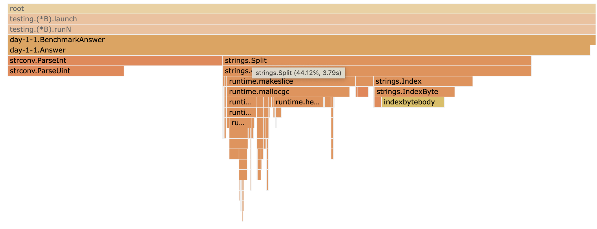
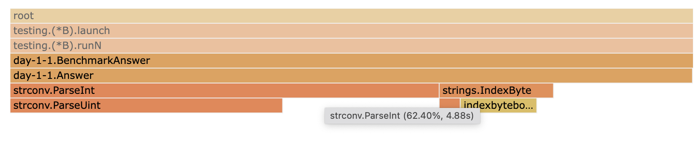
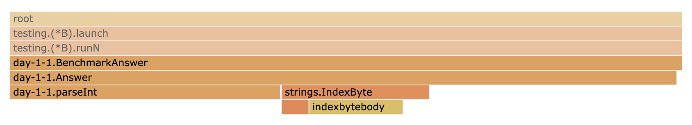
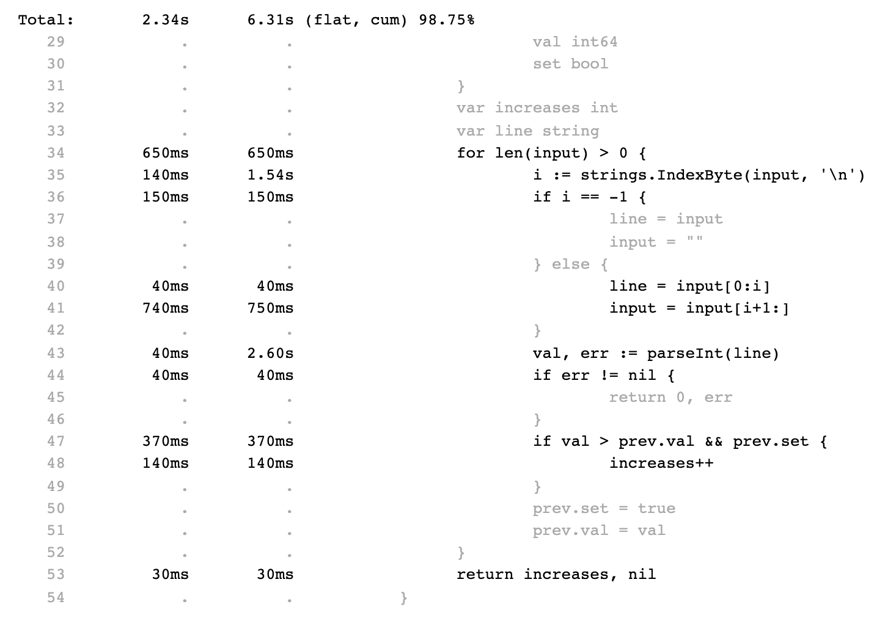

Tis the season to be geeky, so it's time for [Advent of Code 2021](https://adventofcode.com/2021). My theme for last year was [to learn some rust](https://github.com/felixge/advent-2020), but for this year I decided to focus on Go profiling.

The idea is to code up naive solutions and use Go profiling tools to optimize them. A few folks [on twitter](https://twitter.com/felixge/status/1462497895563808775) were interested in seeing the results as blog posts, so I'm hoping to write a few of these.

You can find all code and profiles in the history of this repository: [github.com/felixge/advent-2021](https://github.com/felixge/advent-2021).

*Disclaimer: I currently work on [Continuous Go Profiling](https://www.datadoghq.com/product/code-profiling/) for Datadog, but I'm not barking on behalf of my employer here.*

## v1: Naive Solution

The [day 1-1](https://adventofcode.com/2021/day/1) challenge is pretty easy to solve, so I quickly came up with a [naive solution](https://github.com/felixge/advent-2021/commit/eba7ded758845dbd7daf3cab6bcf0748e3c1aab3), see below.

```go
func Answer(input string) (int, error) {
	var prev struct {
		val int64
		set bool
	}
	var increases int
	for _, line := range strings.Split(input, "\n") {
		val, err := strconv.ParseInt(line, 10, 64)
		if err != nil {
			return 0, err
		}
		if val > prev.val && prev.set {
			increases++
		}
		prev.set = true
		prev.val = val
	}
	return increases, nil
}
```

This works, but is it fast enough? Let's run a [benchmark](https://github.com/felixge/advent-2021/commit/11ffbb4744b873e8e0043ed0a34323cc90f3916a#diff-436569090a9935aee294320a0b795640193e6013e29a1146d97db890d0cfb245).

```txt
$ go test -count 5 -run '^$' -bench . -cpuprofile=v1.cpu.pprof > v1.txt
$ benchstat v1.txt
name      time/op
Answer-6  325ns ± 1%
```

While this may not seem bad to you, it's definitely not Christmas Scale™️, so let's figure out what we can optimize by looking at our CPU profile as a FlameGraph:



Looks like 44% of our time is spend in [`strings.Split()`](https://pkg.go.dev/strings#Split), let's optimize this.

## v2: Optimize strings.Split()

Looking at the FrameGraph above, notice that [`strings.Split()`](https://pkg.go.dev/strings#Split) calls [`strings.IndexByte()`](https://pkg.go.dev/strings#IndexByte) which is [implemented in assembly](https://cs.opensource.google/go/go/+/refs/tags/go1.17.3:src/internal/bytealg/indexbyte_amd64.s). Turns out we can call this directly to do our own newline separation:

```go
func Answer(input string) (int, error) {
	var prev struct {
		val int64
		set bool
	}
	var increases int
	var line string
	for len(input) > 0 {
		i := strings.IndexByte(input, '\n')
		if i == -1 {
			line = input
			input = ""
		} else {
			line = input[0:i]
			input = input[i+1:]
		}
		val, err := strconv.ParseInt(line, 10, 64)
		if err != nil {
			return 0, err
		}
		if val > prev.val && prev.set {
			increases++
		}
		prev.set = true
		prev.val = val
	}
	return increases, nil
}
```

This is a bit more complicated, but let's see what this gives us:

```
$ benchstat v1.txt v2.txt 
name      old time/op  new time/op  delta
Answer-6   325ns ± 1%   168ns ± 2%  -48.25%  (p=0.008 n=5+5)
```

A 48% decrease in execution time — looks like we're off to a good start! What's next?



Seems like [`strconv.ParseInt()`](https://pkg.go.dev/strconv#ParseInt) has become our new bottleneck.

## v3: Optimize strconv.ParseInt()

Even so the elves are not stating it explicitly, they are only giving us positive integers. So we could apply the same trick as before and call [`strconv.ParseUint()`](https://pkg.go.dev/strconv#ParseUint) directly instead of going through [`strconv.ParseInt()`](https://pkg.go.dev/strconv#ParseInt).

However, looking at the [implementation of ParseUint](https://cs.opensource.google/go/go/+/refs/tags/go1.17.3:src/strconv/atoi.go;l=62) it's clear that it is doing a bunch of stuff to support different bases and bit sizes. We don't need any of this, so let's just implement the subset we actually need:

```go
func parseInt(val string) (int64, error) {
	var intVal int64
	factor := int64(1)
	for i := len(val) - 1; i >= 0; i-- {
		c := val[i]
		if c >= '0' && c <= '9' {
			intVal += int64(c-'0') * factor
		} else {
			return intVal, fmt.Errorf("bad int: %q", val)
		}
		factor *= 10
	}
	return intVal, nil
}
```

Let's see if it was worth it:

```txt
$ benchstat v2.txt v3.txt 
name      old time/op  new time/op  delta
Answer-6   168ns ± 2%    92ns ± 3%  -45.29%  (p=0.016 n=5+4)
```

Another 45% — we might be reaching Christmas Scale™️ here after all.

Can we do even better?



The FlameGraph above doesn't give us any obvious clues for what to try next. But we can dig deeper. For example let's take a look a look `View -> Source`:



As you can see we're spending quite a bit of time on the sub-slice operation on line `41`. Is this our next clue?

## v4: The Nerd Snipe

The elves are informing me that the current solution over 3x faster than v1 — which is good enough for now:

```txt
$ benchstat v1.txt v3.txt 
name      old time/op  new time/op  delta
Answer-6   325ns ± 1%    92ns ± 3%  -71.68%  (p=0.016 n=5+4)
```

However they are willing to offer a special **Go Profiling Star** to anybody who manages to further improve upon v3. This is where you can come in. Just send me a link to your v4 solution in [this twitter thread](https://twitter.com/felixge/status/1466128436355899395) including your `benchstats v3.txt v4.txt` output and I will link to it from here.

1. Your name could be here
1. Your name could be here
1. Your name could be here

That's it for today. I'll definitely only find time for doing a few of these posts, but I'll try to keep them coming.