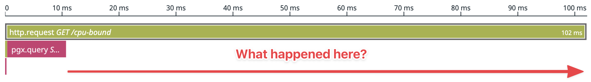
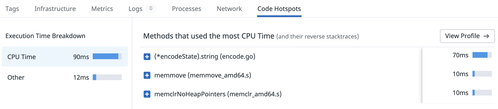
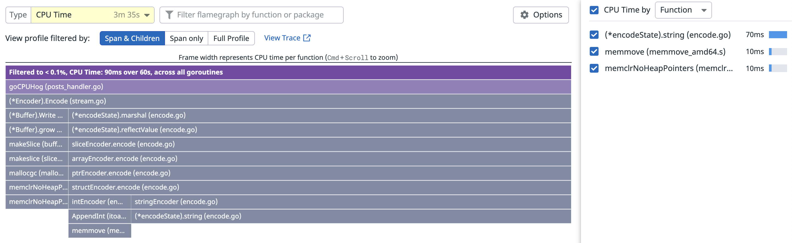
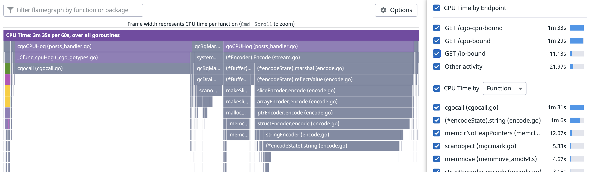
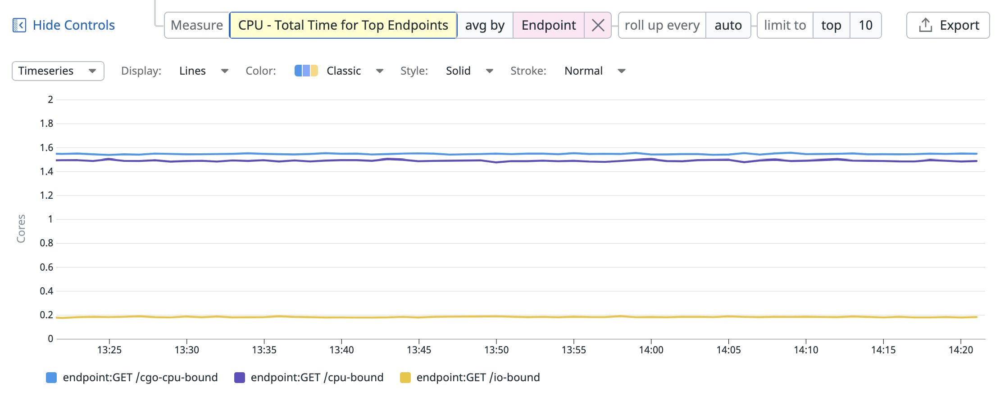

Today I'd like to share a few thoughts on a few new [profiling features](https://docs.datadoghq.com/tracing/profiler/connect_traces_and_profiles/) we recently shipped at Datadog. I'll explain what they do, how they work, and which Go 1.18 contributions were needed in order for things to work well.

## Feature Showcase

Let's start with the end result. Imagine you have a 100ms trace where 10ms are spend on a database query, but 90ms remain unexplained.



When this happens, you usually need to study your code for clues. Did you forget some tracing instrumentation? Time to add it, redeploy and wait. Or perhaps you need to optimize your Go code? If yes, how?

This workflow is manageable, but it turns out there is a better way – we can use profiling data to fill in the gaps. And that's exactly what our new [Code Hotspots](https://docs.datadoghq.com/tracing/profiler/connect_traces_and_profiles/#identify-code-hotspots-in-slow-traces) feature does. As you can see below, our request used 90ms On-CPU time. This is a strong signal that lets us rule out Off-CPU activity such as uninstrumented service calls, mutex contentions, channel waits, sleeping, etc.



Even better, when clicking the "View Profile" button, we can view this On-CPU time as a per-request flame graph. Here we can see that our time was spent on JSON encoding.

And since our http handler functions don't show up in the stack traces, we can also indirectly infer that this work was done in a background goroutine spawned by the goroutine handling the request.



In addition to breaking down tracing information using profiling, we can also do the opposite and break down a profile [CPU Time by Endpoint](https://docs.datadoghq.com/tracing/profiler/connect_traces_and_profiles/#break-down-code-performance-by-api-endpoints) as shown below. The checkboxes can be used to filter the profile by endpoint.



And to make it easier to understand changes over time, e.g. after a deployment, we can graph this data.



## How It Works

The features are built on-top of an existing Go feature called [pprof labels](https://github.com/DataDog/go-profiler-notes/blob/main/guide/README.md#cpu-profiler-labels) which allows us to attach arbitrary key/value pairs to the currently running goroutine. These labels are automatically inherited when a new goroutine is spawned, so they reach into all corners of your code. Crucially these labels are also integrated into the CPU profiler, so they automatically end up in the CPU profiles it produces.

So to implement this feature, we modified the tracing code in our [dd-trace-go](https://github.com/DataDog/dd-trace-go) library to automatically apply labels such as `span id` and `endpoint` whenever a new span is created. Additionally we take care of removing the labels when the span is finished. A simplified example of this implementation can be seen below:

```go
func StartSpan(ctx context.Context, endpoint string) *span {
	span := &span{id: rand.Uint64(), restoreCtx: ctx}
	labels := pprof.Labels(
		"span_id", fmt.Sprintf("%d", span.id),
		"endpoint", endpoint,
	)
	pprof.SetGoroutineLabels(pprof.WithLabels(ctx, labels))
	return span
}

type span struct {
	id         uint64
	restoreCtx context.Context
}

func (s *span) Finish() {
	pprof.SetGoroutineLabels(s.restoreCtx)
}
```

Our actual implementation is a bit more complex and also reduces the risk of leaking PII (Personally Identifiable Information). It automatically covers the HTTP and gRPC wrappers in our contrib package, as well as any custom traces your application may implement.

Once our backend receives the tracing and profiling information, we're able to perform the lookups needed to power the features showcased earlier in this post.

## Profiling Improvements in Go 1.18

As part of implementing these new features, we did a lot of testing, including unit tests, micro-benchmarks, macro-benchmarks and more. As expected, this surfaced problems in our code and allowed us to quickly fix them.

Somewhat less expected, we also discovered several issues in the go runtime that were impacting the accuracy of pprof labels, as well as CPU profiling in general. The good news is that with the help of the community, the go maintainers and contributions from our end – all of these issues have been fixed in the upcoming Go 1.18 release.

If you're interested in the full details on this, check out the companion post: [Profiling Improvements in Go 1.18](/2022/02/07/profiling-improvements-in-go-1.18/).

That being said, unless you use a lot of cgo, the new features should already work great for you in Go 1.17.

## Feedback Wanted

I'm currently looking for people who are interested in taking these new features for a spin in order to get feedback.

It doesn't matter if you're an existing or potential customer, just <a href="mailto:felix@datadog.com?subject=Connecting%20Go%20Profiling%20With%20Tracing" target="_new">send me an email</a> and we can set up a 30 min zoom. To sweeten the deal, I'm also happy to answer general Go profiling questions along the way :).

## Appendix: Getting Started

If you want to get started quickly, you can simply copy the code below into your application.

Additionally you can check out this fully working [dd-trace-go-demo](https://github.com/felixge/dd-trace-go-demo) application that shows an integration including HTTP and PostgreSQL.

```go
package main

import (
	"time"

	"gopkg.in/DataDog/dd-trace-go.v1/ddtrace/tracer"
	"gopkg.in/DataDog/dd-trace-go.v1/profiler"
)

func main() {
	const (
		env     = "dev"
		service = "example"
		version = "0.1"
	)

	tracer.Start(
		tracer.WithEnv(env),
		tracer.WithService(service),
		tracer.WithServiceVersion(version),
		tracer.WithProfilerCodeHotspots(true),
		tracer.WithProfilerEndpoints(true),
	)
	defer tracer.Stop()

	err := profiler.Start(
		profiler.WithService(service),
		profiler.WithEnv(env),
		profiler.WithVersion(version),

		// Enables CPU profiling 100% of the time to capture hotspot information
		// for all spans. Default is 25% right now, but this might change in the
		// next dd-trace-go release.
		profiler.CPUDuration(60*time.Second),
		profiler.WithPeriod(60*time.Second),
	)
	if err != nil {
		panic(err)
	}
	defer profiler.Stop()

	// <your application code>
}
```
