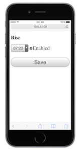
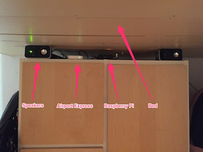

Invented in 1959, the [snooze
button](http://clockhistory.com/westclox/products/electric/drowse/) is the
worst invention in the world. Not only does it defeat the point of setting an
alarm, it may actually [leave you more
tired](http://news.health.com/2012/09/21/snooze-button-better-sleep/).
Unfortunately however, my zombie morning brain doesn't care about this, and any
alarm within reach has a very poor chance of actually getting me out of bed,
trapping me into an open-end snooze fest.

For this reason I usually set an alarm below my loft bed, so I'm forced to
climb down the stairs to disable it. This works, but sometimes I forget to set
this alarm before getting into bed, and my sleepy evening brain convinces
itself that setting the alarm on the phone next to me will do just fine.

And this is exactly how I missed an important early morning conference call
this week.

To avoid this from happening again, I finally implement an idea I had a while
ago for for turning my raspberry pi into a smartphone controlled alarm clock
that I can set from my bed, but only disable by getting up. I've published the
Go code as [Rise 1.0](http://github.com/felixge/rise) on GitHub, and you can
see the result below:

  
  

In a way, this is latest incarnation of a previous [AirPlay based
project](http://www.slideshare.net/the_undefined/building-an-alarm-clock-with-nodejs)
of mine, which unfortunatley suffered from a few issues causing me to abondon
it. However, I feel pretty good about this implementation, and already woke up
successfully with it this morning. 

Given enough interest, I'd be happy to polish this up a bit further and make it
easy to install on any Raspberry Pi or other Linux machine you have laying
around. Just let me know what you think!
