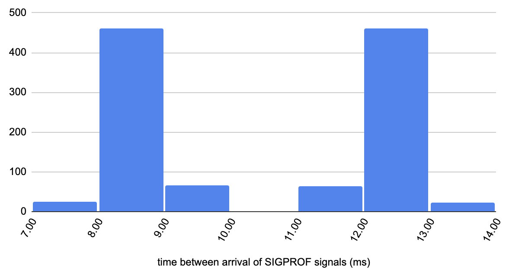
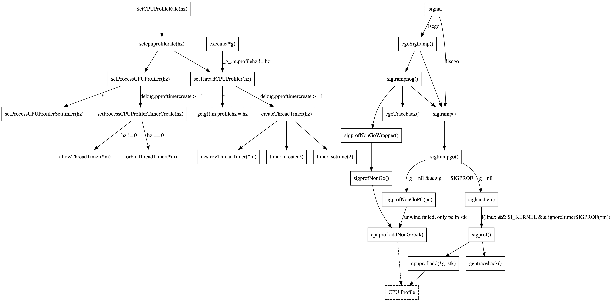

Without doubt, Go 1.18 is shaping up to be one of the most exciting releases since Go 1. You've probably heard about major features such as generics and fuzzing, but this post is not about that. Instead we'll talk about profiling and highlight a few noteworthy improvements to look forward to.

A point of personal joy for me is that I was able to contribute to several of the improvements as part of my job at Datadog and that they will significantly improve our new [Connecting Go Profiling With Tracing](/2022/02/10/connecting-go-profiling-with-tracing/) functionality.

If you're new to Go profiling, you might also enjoy our [Guide to Go Profiling](https://github.com/DataDog/go-profiler-notes/blob/main/guide/README.md) before diving into this post.

## Better CPU Profiling Accuracy

Let's start with the most significant profiling change in Go 1.18 – the CPU profiler for Linux has become a lot more accurate. In particular, CPU bursts on multi-core systems used to be underestimated, which is fixed now.

This change goes back to late 2019 (go1.13) when [Rhys Hiltner](https://github.com/rhysh) opened [GH 35057](https://github.com/golang/go/issues/35057) to report that he noticed a Go services that was using `20` CPU cores according to `top`, but only `2.4` cores according to Go's CPU profiler. Digging deeper, Rhys found that this problem was caused by dropped POSIX signals in the kernel.

To understand the problem, it's worth knowing that Go 1.17's CPU profiler is built on top the [setitimer(2)](https://man7.org/linux/man-pages/man2/setitimer.2.html) syscall. This allows the Go runtime to ask the Linux kernel to get a notification for every `10ms` the program spends running on a CPU. These notifications are delivered as `SIGPROF` signals. Each delivery of a signal causes the kernel to stop the program and invoke the runtime's signal handler routine on one of the stopped threads. The signal handler takes a stack trace of the current goroutine and adds it to the CPU profile. All of this takes less than `~10usec` after which the kernel resumes the execution of the program.

So what was wrong? Well, given Rhys program reporting `20` CPU cores being used by `top`, the expected signal rate should have been `2,000` per second. However, the resulting profile only contained an average of `240` stack traces per second. Further investigation using [Linux Event Tracing](https://www.kernel.org/doc/html/v5.16/trace/events.html) revealed that the expected amount of `signal:signal_generate` events were observed, but not enough `signal:signal_deliver` events. The difference between signal generation and delivery might seem confusing at first, but is due to the fact that standard POSIX signals do not queue, see [signal(7)](https://man7.org/linux/man-pages/man7/signal.7.html). Only a single signal can be pending delivery at a time. If another signal of the same kind is generated while one is already pending, the new signal gets dropped.

However, this still doesn't explain why so many signals would be generated during the exact same `< ~10usec` signal handler window so that they would end up on top of each other. So the next piece to this puzzle is the fact that the resolution of syscalls measuring CPU time are limited to the kernel's software clock which measures time in *jiffies*, see [time(7)](https://man7.org/linux/man-pages/man7/time.7.html). The duration of a jiffy depends on [kernel configuration](https://github.com/torvalds/linux/blob/master/kernel/Kconfig.hz), but the default is `4ms` (`250Hz`). What this means is that the kernel isn't even able to honor Go's wish of receiving a signal every `10ms`. Instead it has to alternate between `8ms` and `12ms` as can be seen in the histogram below ([details](https://docs.google.com/spreadsheets/d/12zGfTIfHBivcYTrbbets-dDyg_OLmVP5x1VLbQeUezg/edit#gid=1108138742)).



But an even more critical aspect of this limited resolution is that it causes situations where the kernel has to generate several `SIGPROF` signals at the same time, causing all except one to be dropped instead of delivered. Or in other words, `setitimer(2)` – the kernel's portable API advertised for profiling – turns out to be unsuitable for profiling busy multi-core systems :(.

However, given that the man pages explain the jiffy limitations of CPU time related syscalls and the semantics of process-directed signals, it's not entirely clear if this would be recognized as a bug by the kernel maintainers. But even if `setitimer(2)` would be fixed, it would take a long time for people to upgrade their kernels, so Rhys brought up the idea of using [`timer_create(2)`](https://man7.org/linux/man-pages/man2/timer_create.2.html) which offers per-thread accounting of pending signals.

Unfortunately the idea didn't receive feedback from the Go maintainers, so the issue sat dormant until Rhys and I started discussing it again in May 2021 [on twitter](https://twitter.com/felixge/status/1397522130904965120). Our plan was to collaborate, Rhys working on the [criticial CPU profiler changes](https://go-review.googlesource.com/c/go/+/324129/21), and me on [better test coverage](https://go-review.googlesource.com/c/go/+/334769) for cgo and other edge cases shown in the diagram below.



Another side quest of mine was to create a standalone C program called [proftest](https://github.com/felixge/proftest) to observe the signal generation and delivery behavior of `setitimer(2)` and `timer_create(2)` which confirmed another [bias issue from 2016](https://github.com/golang/go/issues/14434): `setitimer(2)`'s process-directed signals are not fairly distributed among CPU-consuming threads. Instead [one thread tends to get screwed](https://twitter.com/felixge/status/1400356284285792262) and receives less signals than all other threads. Now, to be fair, [`signal(7)`](https://man7.org/linux/man-pages/man7/signal.7.html) states that the kernel chooses an arbitrary thread to which to deliver process-directed signals when multiple threads are eligible. But on the other hand macOS doesn't show this kind of bias, and I think that's the point where I need to stop making apologies on behalf of the Linux kernel :).

But the good news is that, except for jiffy resolution, `timer_create(2)` doesn't appear to suffer from any of the ailments plaguing `setitimer(2)`. It reliably delivers the right amount of signals and shows no bias towards any particular threads. The only issue is that `timer_create(2)` requires the CPU profiler to be aware of all threads. This is easy for threads created by the Go runtime, but gets very tricky when cgo code is spawning its own threads. Rhys patch deals with this by combining `timer_create(2)` and `setitimer(2)`. When a signal is received, the signal handler checks the origin of the signal and discards it if it's not the best signal source available for the current thread. Additionally the patch also has some clever bits to deal with avoiding bias against short-lived threads and is just a great piece of engineering in general.

Anyway, thanks to lots of review and feedback from the Go maintainers, Rhys patch was merged and will ship with Go 1.18, fixing [GH 35057](https://github.com/golang/go/issues/35057) and [GH 14434](https://github.com/golang/go/issues/14434). My test cases didn't make the cut, partially because it's hard to make non-flaky assertions on profiling data, but mostly because we didn't want to risk those patches taking upstream's attention away from the main changes themselves. Nevertheless this open source community collaboration was one of my favorite computer experiences of 2021!

## Profiler Label Bug Fixes

[Profiler labels](https://github.com/DataDog/go-profiler-notes/blob/main/guide/README.md#cpu-profiler-labels) (aka pprof labels or tags) allow users to associate arbitrary key/value pairs with the currently running goroutine which are inherited by child-goroutines. These labels also end up in CPU and Goroutine profiles, allowing to slice and dice these profiles by label values.

At Datadog we use profiler labels for [Connecting Go Profiling With Tracing](/2022/02/10/connecting-go-profiling-with-tracing/) and as part of working on this feature I did a lot of testing on them. This caused me to observe stack traces in my profiles that should have labels attached, but didn't. I proceeded by reporting the issue as [GH 48577](https://github.com/golang/go/issues/48577) and taking a closer look at the root cause.

Luckily the problem turned out to be really simple. The CPU profiler was sometimes looking at the wrong goroutine when adding the label and required essentially just a one-line fix:

```diff
-cpuprof.add(gp, stk[:n])
+cpuprof.add(gp.m.curg, stk[:n])
```

This might be a bit confusing at first since `gp` is the current goroutine and usually points to the same place as `gp.m.curg` (the current goroutine of the thread `gp` is running on). However, the two are not the same when Go has to switch stacks (e.g. during signal handling, or resizing the stack of the current goroutine), so if the signal arrives at an unfortunate moment, `gp` points to a purely internal goroutine that is executing on behalf of the user, but lacking the labels belonging to the current stack trace `stk`. Apparently this is a common issue, so it is even documented in the [runtime/HACKING.md](https://github.com/golang/go/blob/master/src/runtime/HACKING.md#getg-and-getgmcurg) guide.

Considering the simplicity of the problem, I submitted a [one-line patch](https://go-review.googlesource.com/c/go/+/351751/1) for it. However, the patch was greeted by the classic OSS response – "Can you please write a test for it?" – delivered by [Michael Pratt](https://github.com/prattmic). I initially doubted the ROI of such a test case, but I couldn't have been more wrong. It was definitely very difficult to write a non-flaky test to demonstrate the issue, and the initial version of the patch had to be reverted because of this. However, the process of implementing and improving the test case helped Michael to identify two additional issues related to labels, both of which he ended up fixing:

[CL 369741](https://go-review.googlesource.com/c/go/+/369741) fixed and off-by-one error in the encoding of the first batch of pprof samples causing a small number of samples to be tagged with the wrong labels.

[CL 369983](https://go-review.googlesource.com/c/go/+/369983) fixed an issue causing system goroutines (e.g. for GC) to inherit labels when spawned from user goroutines.

So thanks to all three problems being fixed, profiler labels will become a lot more accurate in Go 1.18. The biggest impact will be for programs using a lot of cgo since C calls run on a separate stack with `gp != gp.m.curg`. However, even regular programs experiencing `3-4%` missing labels in Go 1.17 will benefit from this change and achieve full accuracy.

## Stack Trace Bug Fix

Another profiling related bug that we discovered at Datadog is [GH 49171](https://go-review.googlesource.com/c/go/+/366494/). The problem manifested itself in delta allocation profiles with negative allocation counts. Digging deeper, we encountered non-deterministic program counter (pc) symbolization as a root cause. What this means is that the exact same stack trace (same program counters) would contain different symbols (e.g. filenames) in profiles taken at a different time, which should be impossible.

The bug was also very hard to reproduce in a standalone fashion, and I spend almost a week before succeeding and reporting it upstream. In the end it turned out to be a compiler regression involving inlined closures in Go 1.17 and was fixed by [Than McIntosh](https://github.com/thanm).

## Epilog

I hope you enjoyed my summaries of these profiling related improvements in Go 1.18. Please let me know if I missed anything or if you have any questions or feedback. Thank you for reading.
